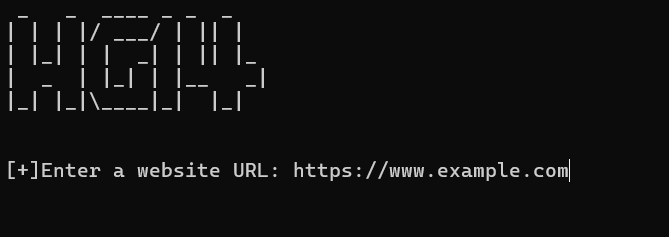
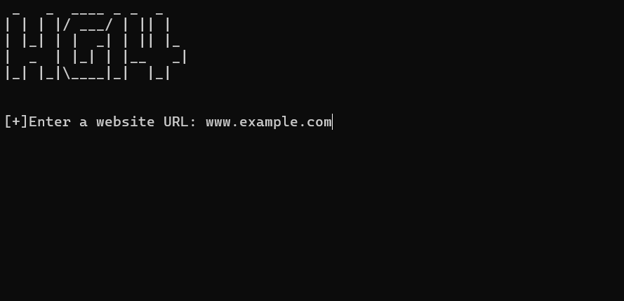

# HG14: Subdomain Enumeration Tool
## Subd.py

## Subdomain.py


## Table of Contents
- [Introduction](#introduction)
- [Fetures](#features)
- [Prerequisites](#prerequisites)
- [Installation](#installation)

## Introduction 
HG14 is a Python-based subdomain enumeration tool that helps identify subdomains and domains linked to a given website. It uses HTML parsing techniques to extract URLs and identify subdomains for security assessments and reconnaissance.

---

## Features

- **Subdomain Identification**: Extracts subdomains and domains from a given website URL.
- **HTML Parsing**: Uses BeautifulSoup for efficient extraction of anchor tags and URLs.
- **User-Agent Customization** (in `subdomain.py`): Bypasses basic detection mechanisms by web servers.
- **SSL Verification Disablement** (in `subdomain.py`): Ignores SSL certificate errors during requests.

---

## Prerequisites

- Python 3.x
- Required libraries: `requests`, `bs4`, `pyfiglet`, `urllib3`

---

## Installation

### Clone the Repository

```bash
git clone https://github.com/himanshigupta14/Subdomain-Enumeration.git
cd Subdomain-Enumeration
